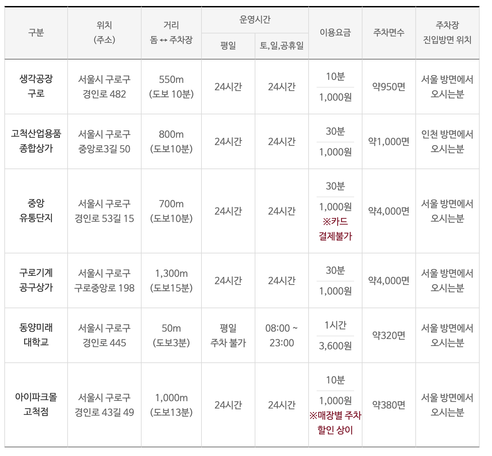

대형 콘서트와 페스티벌 장소로 자리 잡은 고양종합운동장(일산서구 대화동). 행사 날이면 "주차 어디에 하지?"가 가장 큰 고민입니다. 고양도시관리공사 공식 자료를 토대로 주차장 규모, 요금 계산법, 그리고 만차일 때의 대안까지 정리했습니다.

## 주차장 규모: 단지 전체 약 860면

고양종합운동장은 바로 옆 고양체육관(소노 아레나)과 주차장을 한 단지로 운영합니다. 공식 안내 기준으로 체육관 쪽 제1~3주차장·지하주차장이 약 636개, 운동장 쪽 VIP·보조구장 주차장이 약 224개, 합쳐서 약 860개 규모입니다. 평소에는 넉넉하지만, 주경기장급 콘서트(수만 명)에는 턱없이 부족하다는 뜻이기도 합니다.

## 요금: "일 최대 요금이 없습니다" (중요)

공식 요금은 **최초 1시간 1,000원, 이후 5분마다 170원**입니다. 입차 후 10분 이내 회차는 무료이고, 24시간 연중무휴로 운영됩니다. 결제는 **카드 전용(현금 불가)**이며, 키오스크에서 사전정산 후 출차할 수 있습니다.

여기서 많은 분이 놓치는 포인트가 있습니다. 올림픽공원(일 최대 2만 원)과 달리 **이곳은 1일 최대 요금 상한이 없습니다.** 대략 1시간에 2,000원꼴이라, 공연 관람으로 5~6시간 머물면 1만 원 안팎이 나옵니다. "하루 종일 세워도 얼마 안 하겠지"라고 생각하면 안 되는 구조입니다.

할인은 장애인·국가유공자·고엽제후유의증 100%, 경차·저공해차 50% 등이 적용되고, 단지 내 수영장·헬스 등 시설 회원은 2~3시간 감면을 받을 수 있습니다.

## 상황별 전략

**① 대형 콘서트·페스티벌 날** — 860면은 금세 찹니다. 최소 2~3시간 전 도착이 기본이고, 행사에 따라 주최 측이 주차장을 통제하거나 별도 요금을 적용하는 경우도 있으니 예매처 공지를 꼭 확인하세요. 끝난 뒤 출차 정체도 상당합니다.

**② 만차 대비 플랜B** — 도보권에 대화체험공원 주차장(무료) 등 공영주차장이 있고, 조금 떨어진 킨텍스 제2전시장 지하주차장도 대안이 됩니다. 카카오맵·네이버지도에서 '공영주차장'을 검색해 2~3곳을 미리 즐겨찾기해 두세요.

**③ 가장 마음 편한 방법** — 지하철 3호선 대화역에서 도보 5~10분 거리입니다. 행사 날에는 대화역 인근 환승주차장에 차를 두고 한 정거장만 걸어가는 것이 시간·비용 모두 이득인 경우가 많습니다.

**④ 평일 운동·산책 방문** — 이때는 여유롭습니다. 다만 카드 전용 주차장이니 현금만 들고 가시면 곤란해질 수 있다는 점만 기억하세요.

정리하면 핵심은 세 가지입니다. **일 최대 요금이 없으니 장시간 주차는 요금을 미리 계산할 것, 행사 날은 2~3시간 전 도착 또는 대중교통, 플랜B 주차장을 미리 찜해둘 것.**

---

※ 본 글의 요금·주차면수는 고양도시관리공사 공식 안내(2026년 6월 확인 기준)를 토대로 작성했습니다. 행사 시 운영 방식이 달라질 수 있으니 방문 전 공식 공지를 확인하세요.

[출처]

- 고양체육관(고양도시관리공사) 주차장 안내: [https://gym.gys.or.kr:447/info/parking.php](https://gym.gys.or.kr:447/info/parking.php)
- 고양도시관리공사 공영주차장 요금 안내: [https://park.gys.or.kr/user/parkingInfo/fee](https://park.gys.or.kr/user/parkingInfo/fee)
- 인근 주차장·교통 정보 참고: [https://jiiin.co.kr](https://jiiin.co.kr) (고양종합운동장 주차 꿀팁)

[고양종합운동장 주차장 총정리 — 콘서트 날 요금 계산법과 만차 대비 플랜B](/entry/고양종합운동장-주차장-총정리-—-콘서트-날-요금-계산법과-만차-대비-플랜B)

[고척스카이돔 주차장 완벽 정리 — 경기·콘서트 날 "돔 안 주차 안 됩니다", 대안 주차장 5곳](/entry/고척스카이돔-주차장-완벽-정리-—-경기·콘서트-날-돔-안-주차-안-됩니다-대안-주차장-5곳)

[올림픽공원 주차장 총정리, 목적지별 추천 주차장과 요금, 헷갈리지 않는 법](/entry/올림픽공원-주차장-총정리-목적지별-추천-주차장과-요금-헷갈리지-않는-법)

[학여울역 SETEC 주차 요금•위치, 외부 주차장(은마상가 주차 꿀팁)](/entry/🅿-학여울역-SETEC-주차-요금•위치-외부-주차장은마상가-꿀팁)
