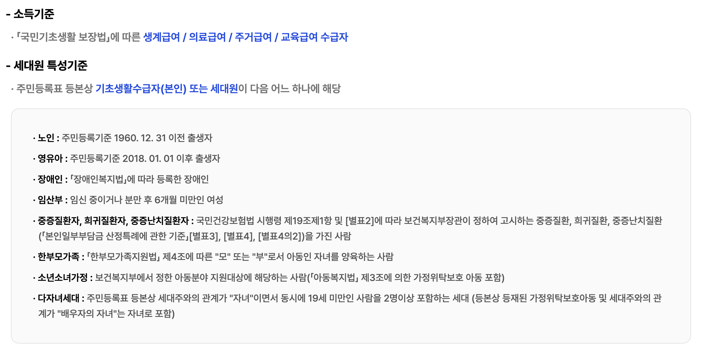
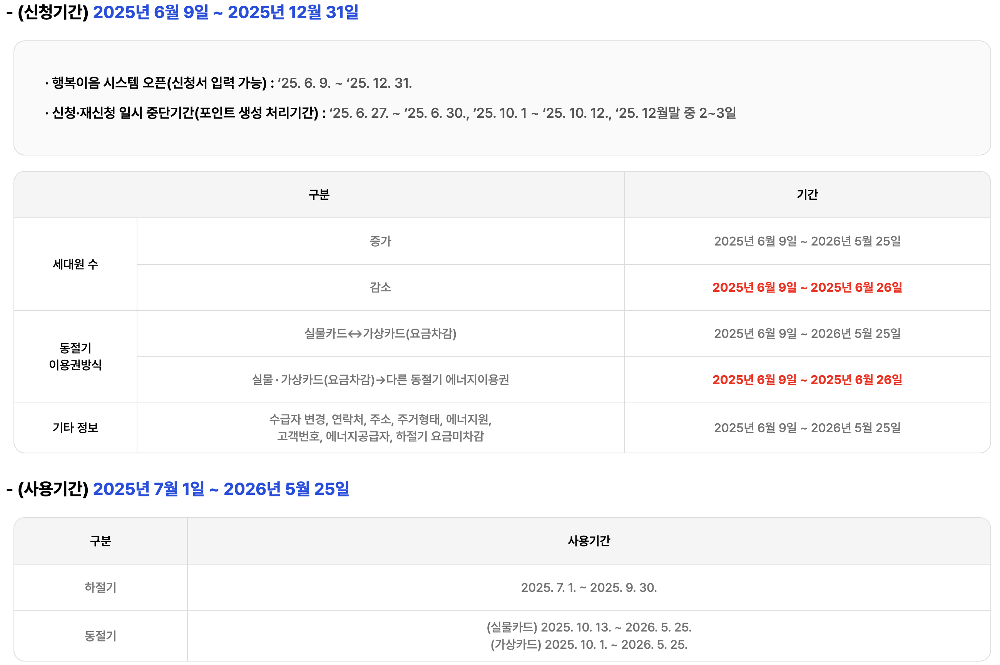

전기요금 무서워서 한여름에 에어컨을 못 켜는 어르신 가구가 많습니다. 그런 분들을 위해 정부가 전기·가스·난방 요금을 대신 차감해 주는 제도가 에너지바우처입니다. 그리고 올해 2026년, 이 제도가 크게 바뀌었습니다. 결론부터 말씀드리면 — 이제 겨울 난방비 몫을 여름 냉방비로 몰아 쓸 수 있게 됐고, 지원 가구도 늘었습니다.

출처 https://www.energyv.or.kr/board/boardDetail.do?mstBoardId=49&boardId=1380

## 올해 무엇이 달라졌나

예전에는 여름용(냉방)과 겨울용(난방) 금액이 칸막이로 나뉘어 있어, 여름에 덜 쓰면 아깝게 느껴지고 겨울엔 모자라는 일이 많았습니다. 2026년부터는 이 계절 칸막이가 폐지되어, 연간 지급된 금액 전체를 원하는 시기에 자유롭게 쓸 수 있습니다. 더위를 많이 타는 가구는 여름에, 추위가 걱정인 가구는 겨울에 집중해서 쓰면 됩니다. 정부는 올해 추가경정예산으로 지원을 확대해 약 130만 가구를 지원할 계획입니다.

## 누가 받을 수 있나 (두 가지 모두 충족해야 합니다)

① **소득 기준**: 생계급여 또는 의료급여 수급 가구 ② **가구원 기준**: 가구원 중 다음 한 명 이상 — 만 65세 이상 어르신, 만 6세 미만 영유아, 등록 장애인, 임산부, 중증·희귀·난치질환자, 한부모가족

본인이나 부모님 가구가 해당하는지 헷갈린다면, 에너지바우처 누리집의 '모의진단'을 해보거나 콜센터 1600-3190에 전화하면 바로 확인해 줍니다.

## 얼마나 받나

가구원 수에 따라 연간 1인 295,200원, 2인 407,500원, 3인 532,700원, 4인 이상 701,300원입니다. 전기·도시가스·지역난방 요금에서 자동 차감되는 방식과, 국민행복카드로 등유·LPG·연탄까지 결제하는 방식 중 선택합니다. 한 가지 꼭 기억하실 점 — 기간 내 못 쓴 잔액은 소멸되며 환급되지 않습니다.

## 언제, 어떻게 신청하나

신청은 2026년 6월 중순부터 12월 31일까지, 주민등록지 읍·면·동 행정복지센터 방문 또는 복지로(bokjiro.go.kr) 온라인으로 하면 됩니다. 지역에 따라 접수 시작일이 며칠 다를 수 있으니 방문 전 행정복지센터에 전화 확인을 권합니다. 바우처 사용은 2026년 7월 1일부터 가능하므로, **폭염이 오기 전인 6월에 신청을 마쳐두는 것**이 핵심입니다. 작년에 받았던 가구는 별도 신청 없이 자동 연장되는 경우가 많지만, 수급 자격이 바뀌었다면 다시 확인이 필요합니다.

부모님이 대상인데 거동이 불편하시다면, 대리 신청도 가능하니 자녀분이 신분증과 위임 서류를 챙겨 행정복지센터를 방문하시면 됩니다. 이런 제도는 "아는 사람만 받는" 경우가 많습니다. 주변에 해당될 만한 어르신이 계시다면 이 글을 공유해 주세요.

---

※ 본 글은 산업통상자원부·한국에너지공단 안내(2026년 6월 확인 기준)를 토대로 작성했으며, 세부 일정·금액은 변경될 수 있으니 신청 전 공식 누리집 또는 1600-3190으로 확인하세요.

[출처]

- 에너지바우처 공식 누리집: [https://www.energyv.or.kr](https://www.energyv.or.kr) (콜센터 1600-3190)
- 복지로: [https://www.bokjiro.go.kr](https://www.bokjiro.go.kr)
- 2026년 제도 개편(계절 칸막이 폐지·추경 확대) 보도: christiandaily.co.kr/news/159858 외

[중년 고혈압·당뇨·혈당관리, 체력·질병·예방 방법 정리](/entry/중장년층-건강의-핵심-질병-예방과-관리로-똑똑하게-건강-챙기기)
