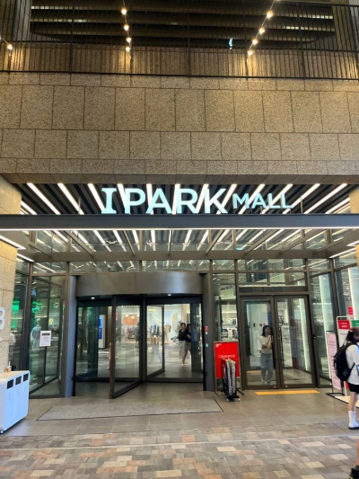
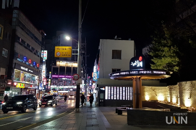

고척스카이돔 콘서트는 일찍 도착하는 게 정석입니다. 주차도, MD(기념품) 줄도, 입장 줄도 전부 시간 싸움이거든요. 그런데 막상 2~3시간 일찍 도착하면 "이제 뭐 하지?"가 됩니다. 자녀 콘서트에 동행하신 부모님이라면 더 막막하죠. 그래서 고척돔 도착 후 2시간을 보내는 동선을 정리했습니다.

먼저 주차부터 해결하셔야 한다면 — 고척돔은 공연 날 돔 안 주차가 안 됩니다. 인근 주차장 5곳을 정리한 글을 먼저 보고 오세요.

[고척스카이돔 주차장 완벽 정리 — 경기·콘서트 날 "돔 안 주차 안 됩니다", 대안 주차장 5곳](/entry/고척스카이돔-주차장-완벽-정리-—-경기·콘서트-날-돔-안-주차-안-됩니다-대안-주차장-5곳)

## 선택지 1. 아이파크몰 고척점 — 가장 무난한 정답 (도보 약 15분)

2022년 말에 문을 연 복합 쇼핑몰로, 지하 3층부터 지상 2층까지 식당가·푸드코트·카페·코스트코가 모여 있습니다. 냉난방 되는 실내에서 식사부터 커피, 화장실까지 한 번에 해결되니 어르신·가족 단위에는 여기가 가장 편합니다. 몰 안 베이커리 카페(르디투어, 루시카토 등)는 공연 전 시간을 보내기 좋고, 식사 후 천천히 걸어가면 소화도 됩니다. 단, 공연 날 저녁에는 같은 생각을 한 관객들로 식당가가 붐비니 식사는 조금 이른 시간(4~5시)에 권합니다.

## 선택지 2. 동양미래대 앞 골목 — 가성비 한 끼 (도보 5분)

돔 바로 길 건너 대학가라 순대국, 돈까스, 라멘, 분식 같은 부담 없는 식당이 모여 있습니다. 콘서트 팬들 사이에서도 "고척돔 앞 먹자골목"으로 통하는 곳입니다. 줄이 길면 옆 가게로 옮기기 쉬운 것도 장점입니다. 다만 좌석이 작은 가게가 많아 4인 이상이면 아이파크몰이 낫습니다.

## 선택지 3. 시간이 애매할 때 — 돔 주변에서 해결

1시간 남짓이라면 멀리 가지 마세요. 돔 외곽의 편의점은 공연 직전 매우 붐비니 음료·간식은 미리 사두시고, MD 구매 예정이라면 이 시간을 줄 서기에 쓰는 게 현실적입니다. 화장실은 입장 전 아이파크몰이나 인근 카페에서 미리 다녀오는 것이 좋습니다 — 입장 후 공연장 화장실 줄이 가장 깁니다.

## 부모님(동행 보호자)을 위한 팁

자녀만 입장시키고 기다리신다면, 공연 시간(보통 2시간 30분~3시간) 동안 아이파크몰에서 쇼핑·식사를 하며 기다리는 동선이 가장 편합니다. 끝나는 시간에 맞춰 돔 앞은 인파가 쏟아지니, 만날 장소는 돔 정문이 아니라 **아이파크몰 입구처럼 떨어진 지점**으로 미리 정해두세요. 휴대폰 배터리가 부족하면 인파 속에서 연락이 끊기니 보조배터리도 챙기시고요.

공연이 끝난 뒤 바로 차를 빼면 출차 정체에 갇힙니다. 근처에서 차 한잔하고 30분 뒤 출발하는 게 오히려 빠릅니다 — 주차 글에서 말씀드린 그 팁, 여기서도 유효합니다.

[고척스카이돔 주차장 완벽 정리 — 경기·콘서트 날 "돔 안 주차 안 됩니다", 대안 주차장 5곳](/entry/고척스카이돔-주차장-완벽-정리-—-경기·콘서트-날-돔-안-주차-안-됩니다-대안-주차장-5곳)

---

※ 상권 정보는 2026년 6월 기준이며, 매장 운영 상황은 바뀔 수 있습니다. 특정 식당 방문 전 영업 여부를 지도 앱으로 확인하세요.

[출처]

- 아이파크몰 고척점 시설 정보: 한국관광공사 열린관광(access.visitkorea.or.kr)
- 고척돔 인근 식당가 정보 참고: OFS매거진(고척돔 맛집 16곳), 다이닝코드 고척동 카페 순위
