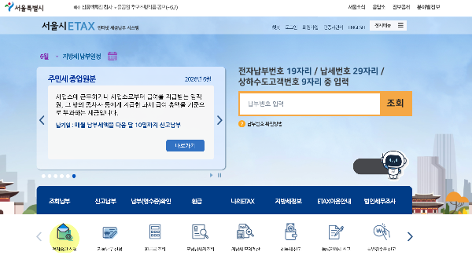

다음 달이면 어김없이 재산세 고지서가 날아옵니다. 그런데 올해 재산세를 누가 내는지는 사실 이미 정해졌습니다 — 기준일이 지난 6월 1일이었기 때문입니다. 고지서 받고 허둥대지 않도록, 7월 재산세의 핵심과 한 푼이라도 아끼는 방법을 미리 정리해 드립니다.

## 기본 구조: 6월 1일 보유자가, 7월과 9월에 나눠 냅니다

재산세는 매년 6월 1일 현재 부동산을 보유한 사람에게 부과되는 지방세입니다. 주택분은 1년 치를 절반으로 나눠 7월(16~31일)과 9월(16~30일)에 냅니다. 단, 세액이 20만 원 이하면 7월에 한 번에 고지됩니다. 고지서에는 재산세 외에 지방교육세(재산세액의 20%) 등이 함께 합산되어 나오니, "생각보다 많네?" 싶으면 그 때문입니다.

올해 5월 말에 집을 판 분은 올해 재산세가 없고, 6월 2일에 잔금을 치르고 산 분은 올해 치를 내지 않습니다 — 이 "6월 1일" 기준 때문에 5~6월 부동산 거래에서는 잔금일 하루 차이로 1년 치 세금이 갈립니다. 내년 매매 계획이 있다면 기억해 둘 포인트입니다.

## 놓치면 손해 1 — 기한 넘기면 3% 가산

납부기한(7월 31일)을 넘기면 3%의 납부지연가산세가 붙고, 세액이 45만 원 이상이면 한 달마다 0.66%가 추가로 붙습니다. 깜빡하는 게 가장 비싼 실수입니다. 자동이체나 전자고지를 신청해 두면 이런 일을 막을 수 있고, 전자고지·자동이체 신청 시 소액의 세액공제(지자체별 상이)도 받을 수 있습니다.

## 놓치면 손해 2 — 카드 무이자와 수수료 0원

재산세 같은 지방세는 신용카드로 내도 수수료가 없습니다. 게다가 7월이 되면 카드사들이 일제히 재산세 이벤트를 엽니다 — 통상 2~3개월 무이자 할부가 기본이고, 카드사에 따라 6~12개월 부분 무이자, 포인트 결제, 캐시백을 내겁니다. 세액이 수십만 원이라면 무이자 할부만으로도 부담이 확 줄어드니, 납부 전에 쓰시는 카드사 앱의 '이벤트' 메뉴를 꼭 확인하세요.

납부는 위택스(스마트위택스 앱), 서울은 STAX(서울시 이택스) 앱이 가장 간편하고, 은행 ATM·ARS로도 가능합니다. 고지서 없이도 앱에서 조회·납부가 됩니다.

## 놓치면 손해 3 — 1주택자 감면 확인

공시가격 9억 원 이하 주택을 보유한 1세대 1주택자는 일반보다 낮은 특례세율이 적용되어 재산세가 줄어듭니다. 보통 고지서에 자동 반영되지만, 본인이 대상인데 적용이 안 된 것 같다면 구청 세무과에 확인해 보세요. 공동명의 부부는 지분대로 각자 고지서가 나오는데, 카드 혜택을 노린다면 한 사람이 몰아 납부하는 것도 방법입니다.

**정리하면 7월에 할 일은 세 가지입니다. ① 고지서(또는 위택스 앱) 확인 ② 카드사 무이자 이벤트 비교 ③ 31일 전 납부 + 전자고지 신청.** 9월 2차분 때 이 글을 다시 꺼내 보셔도 그대로 통합니다.

---

※ 본 글은 위택스·서울시 이택스 안내 및 2026년 6월 기준 정보를 토대로 작성했습니다. 카드사 이벤트는 매년 7월 초 확정되므로 납부 직전 각 카드사 공지를 확인하세요. 세금은 개별 상황에 따라 다를 수 있어, 정확한 세액은 고지서와 관할 지자체 확인이 우선입니다.

[출처]

- 위택스(지방세 납부): [https://www.wetax.go.kr](https://www.wetax.go.kr) / 서울시 이택스(STAX): [https://etax.seoul.go.kr](https://etax.seoul.go.kr)
- 재산세 부과 기준·납부기간: zippoom.com 재산세 가이드(2026.1), 서울시 이택스 안내
- 가산세·카드 납부: yellowit.co.kr 재산세 납부방법(2026.5), 카드사별 지방세 무이자 안내

[2026 에너지바우처, 올해부터 여름 냉방비로 몰아 쓸 수 있습니다 (대상·금액·신청법)](/entry/2026-에너지바우처-올해부터-여름-냉방비로-몰아-쓸-수-있습니다-대상·금액·신청법)
