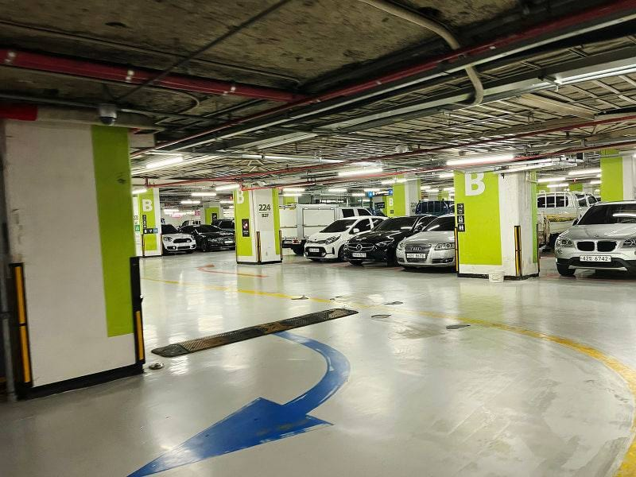

## 주차요금

이번 방문에서는 정산기나 요금 안내판을 따로 확인하지 못해, 기본요금·추가요금·1일 최대·감면 조건을 표로 정리해 드리기 어렵습니다. 확인되지 않은 금액을 임의로 적는 대신, 방문 전 롯데백화점 본점 공식 채널이나 입차 후 정산기 화면에서 최신 요금을 직접 확인하시길 권해드립니다. (현장 확인 필요)

## 위치·입구

첨부한 사진은 지하 주차장 B구역으로, 초록색으로 칠해진 기둥이 구역 구분 표시 역할을 하고 있습니다.

지하 주차장은 구역마다 기둥 색상과 알파벳(A, B, C 등)이 함께 표시되어 있어, 주차 직후 "초록색 B구역"처럼 색상과 알파벳을 같이 기억해두면 출차 시 헷갈리지 않습니다. 다만 롯데백화점 본점은 입구가 여러 곳으로 나뉘어 있는데, 이번 방문에서는 어느 입구가 이 B구역으로 바로 연결되는지까지는 확인하지 못했습니다. 처음 방문하신다면 안내데스크나 현장 표지판에서 입구를 한 번 더 확인하시는 것이 안전합니다.

## 근처 대안 주차장

본점 주차장이 만차일 경우 이용할 만한 주변 대안 주차장의 도보 시간이나 요금은 이번 방문에서 직접 확인하지 못했습니다. 정확하지 않은 정보를 드리는 대신, 만차 안내를 받으시면 지도 앱에서 인근 공영주차장이나 주변 건물 주차장을 검색해 도보 거리와 요금을 비교해보시길 권합니다. (현장 확인 필요)

## 현장 팁

- 사진처럼 지하 주차장은 구역마다 기둥 색상이 다르게 칠해져 있습니다. 주차 직후 기둥과 구역 알파벳이 함께 보이도록 사진을 찍어두면, 넓은 주차장에서 차를 다시 찾을 때 수월합니다.
- 사진 속 구간처럼 기둥 간격이 다소 좁은 편이라, 차폭이 넓은 차량은 서행하며 신중하게 주차하는 것이 안전합니다. 옆 차량과의 간격을 확인하고 문을 여는 습관을 들이면 좋습니다.
- 혼잡 시간대나 정산 방식(사전 정산기 이용 여부, 출차 시 차단기 작동 방식 등)은 이번 방문에서 기록하지 못해 다음 방문 시 확인해 보완할 예정입니다.

<!-- ⚠️ [사람 검수 필요] 발행 전 확인
경로: 현장 캡처(/주차) · 엔진: claude-cli
주차요금(기본·추가·1일최대·감면), 정확한 입구 위치, 근처 대안 주차장 정보는 이번 현장 방문에서 확인되지 않아 본문에 넣지 않았습니다. 발행 전 담당자가 공식 채널이나 재방문을 통해 이 세 항목을 보완할지 결정해 주세요.
-->
